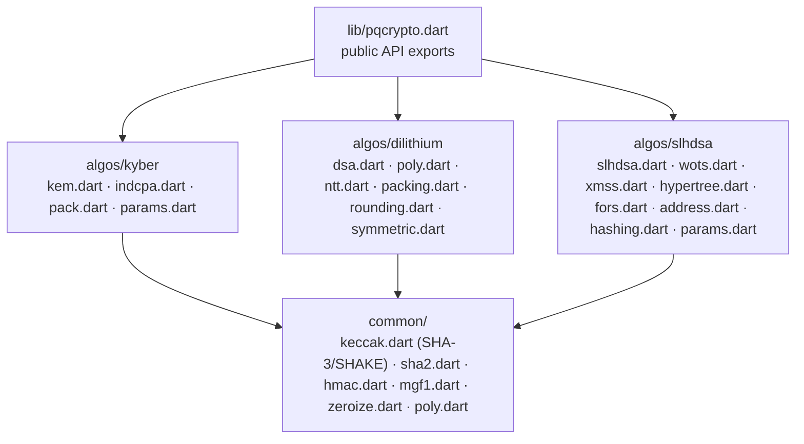

# Architecture

`pqcrypto` is a pure Dart package with three supported algorithm surfaces —
ML-KEM (FIPS 203), ML-DSA (FIPS 204), and SLH-DSA (FIPS 205) — sharing a vendored
FIPS 202 (SHA-3/SHAKE) core, with FIPS 180-4 (SHA-2) plus HMAC/MGF1 for
HashML-DSA and the SLH-DSA SHA-2 parameter sets. There are no native bindings and
no third-party runtime dependencies.

## Package shape



## Public API boundary

`lib/pqcrypto.dart` exports exactly:

```dart
// ML-KEM (FIPS 203)
export 'src/algos/kyber/kem.dart' show KyberKem, PqcKem;

// ML-DSA (FIPS 204)
export 'src/algos/dilithium/dsa.dart' show MlDsa;
export 'src/algos/dilithium/params.dart' show DilithiumParams, DilithiumParameter;

// SLH-DSA (FIPS 205)
export 'src/algos/slhdsa/params.dart'
    show SlhDsaHashFamily, SlhDsaParameter, SlhDsaParams;
export 'src/algos/slhdsa/slhdsa.dart' show SlhDsa, SlhDsaPreHash;
```

Everything else — the SHA-3/SHAKE/SHA-2 primitives, polynomial arithmetic,
packing, sampling — is internal under `src/` and intentionally **not** exported.
Application concerns (AEAD, HKDF, X25519, key storage) are out of scope by
design; compose them from your stack (see [Cookbook](Cookbook)).

## Design choices

- **Separate polynomial types.** ML-KEM (`q = 3329`, incomplete NTT) and ML-DSA
  (`q = 8380417`, complete NTT) use different rings, so they use different
  polynomial types rather than a shared abstraction — easier to audit.
- **Pure Dart arithmetic.** Typed integer arrays and web-safe arithmetic (no
  reliance on signed `>>`/`<<` that `dart2js` evaluates as 32-bit) so behavior is
  identical on the VM, `dart2js`, and `dart2wasm`.
- **Best-effort hardening.** Constant-time output selection in ML-KEM
  decapsulation, no-early-exit norm checks in ML-DSA, and best-effort
  zeroization of secret buffers in `finally` blocks. These are best-effort, not
  hard guarantees — see [Security Posture](Security-Posture).
- **Evidence-scoped.** Conformance is demonstrated by checked-in KAT vectors,
  unit/web tests, and OpenSSL interop — not by certification.

## Dive deeper

- Canonical:
  [ARCHITECTURE.md](https://github.com/turkananation/pqcrypto/blob/main/doc/ARCHITECTURE.md)
- [Design Philosophy](Design-Philosophy) · [Performance](Performance) ·
  [Validation & Interoperability](Validation-and-Interoperability)
- Engineering setup:
  [ENGINEERING_GUIDE.md](https://github.com/turkananation/pqcrypto/blob/main/doc/ENGINEERING_GUIDE.md)
