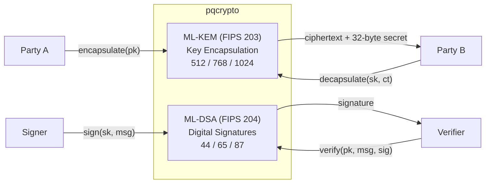

# pqcrypto — Pure Dart Post-Quantum Cryptography 🛡️

[](https://pub.dev/packages/pqcrypto)
[](https://github.com/turkananation/pqcrypto/blob/main/pubspec.yaml)
[](ML-KEM)
[](ML-DSA)
[](Validation-and-Interoperability)
[](Installation)

**`pqcrypto`** is a pure Dart, zero-dependency library implementing the
NIST-standardized post-quantum algorithms **ML-KEM (FIPS 203)** and
**ML-DSA (FIPS 204)** — byte-exact against the official Known-Answer-Test
vectors, with ML-KEM additionally proven to interoperate with OpenSSL. It runs
everywhere Dart runs: Dart servers, Flutter on iOS/Android/desktop, and the web
(`dart2js` / `dart2wasm`).

It exists because the asymmetric algorithms most software relies on today (RSA,
ECDH, ECDSA) are broken by a large quantum computer running Shor's algorithm.
ML-KEM and ML-DSA are the NIST replacements, and `pqcrypto` brings them to the
Dart and Flutter ecosystem with no native bindings and no third-party packages.

> **Claim boundary.** This is **algorithm/KAT-conformance and interoperability
> evidence**, *not* a CMVP/FIPS 140 module validation. See
> [Security Posture](Security-Posture) and
> [FIPS Compliance](FIPS-Compliance) for exactly what is and is not claimed.

## What you get



`pqcrypto` provides **only** these two primitives. Symmetric encryption (AEAD),
key derivation (HKDF), classical key exchange (X25519), hashing, and key storage
are intentionally out of scope — bring them from your application stack. The
[Cookbook](Cookbook) shows exactly how to compose them.

## 60-second quickstart

```dart
import 'dart:convert';
import 'dart:typed_data';
import 'package:pqcrypto/pqcrypto.dart';

void main() {
  // --- ML-KEM: establish a shared secret ---
  final kem = PqcKem.kyber768;               // or .kyber512 / .kyber1024
  final (pk, sk) = kem.generateKeyPair();    // (publicKey, secretKey)
  final (ct, ssSender) = kem.encapsulate(pk); // ciphertext + 32-byte secret
  final ssReceiver = kem.decapsulate(sk, ct); // identical 32-byte secret

  // --- ML-DSA: sign and verify ---
  final params = DilithiumParams.mlDsa65;     // or mlDsa44 / mlDsa87
  final (sigPk, sigSk) = MlDsa.generateKeyPair(params);
  final msg = Uint8List.fromList(utf8.encode('hello post-quantum'));
  final ctx = Uint8List.fromList(utf8.encode('myapp/v1')); // domain separation
  final sig = MlDsa.sign(sigSk, msg, params, ctx: ctx);     // hedged by default
  final ok = MlDsa.verify(sigPk, msg, sig, params, ctx: ctx);
}
```

New here? Read [Installation](Installation) → [Quickstart](Quickstart) →
[Cookbook](Cookbook).

## Status snapshot

| Area          | State                                                             |
| ------------- | ----------------------------------------------------------------- |
| Version       | 0.4.0                                                             |
| Dependencies  | Zero runtime dependencies (pure Dart)                             |
| ML-KEM        | 512 / 768 / 1024 — byte-exact KATs + OpenSSL interop A–G          |
| ML-DSA        | 44 / 65 / 87 — byte-exact KATs (raw/pure/hashed × det/hedged)     |
| SLH-DSA       | All 12 sets (SHAKE + SHA-2) — byte-exact on 1,248 ACVP cases      |
| Platforms     | Dart VM, Flutter (iOS/Android/desktop), Web (dart2js / dart2wasm) |
| Certification | Not CMVP/FIPS 140 validated — algorithm/KAT evidence only         |

## Explore the wiki

**Getting started** · [Installation](Installation) ·
[Quickstart](Quickstart) · [Cookbook (project ideas)](Cookbook)

**Algorithms** · [Cryptographic Algorithms](Cryptographic-Algorithms) ·
[ML-KEM (FIPS 203)](ML-KEM) · [ML-DSA (FIPS 204)](ML-DSA) ·
[SLH-DSA (FIPS 205)](Cryptographic-Algorithms#slh-dsa-fips-205)

**Design & internals** · [Design Philosophy](Design-Philosophy) ·
[Architecture](Architecture) · [Performance](Performance)

**Assurance** · [Security Posture](Security-Posture) ·
[FIPS Compliance](FIPS-Compliance) ·
[Validation & Interoperability](Validation-and-Interoperability)

**Integration** · [Serverpod & Flutter](Serverpod-Integration) ·
[Multi-Agent PQC Framework](Multi-Agent-Framework)

**Project** · [Roadmap](Roadmap) · [FAQ](FAQ) · [Contributing](Contributing) ·
[Documentation Index](Documentation-Index)

## Canonical documentation

The wiki is the friendly front door; the authoritative, version-controlled
documentation lives in the repository's
[`doc/`](https://github.com/turkananation/pqcrypto/tree/main/doc) directory and
on the [pub.dev API docs](https://pub.dev/documentation/pqcrypto/latest/). The
[Documentation Index](Documentation-Index) maps every document.
