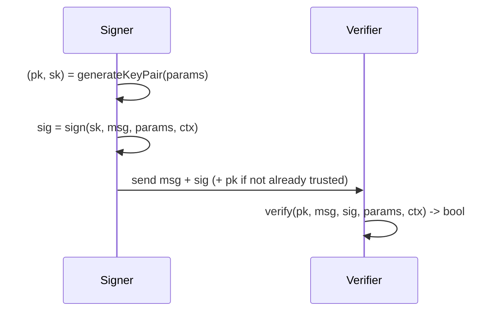

# ML-DSA (FIPS 204)

**Module-Lattice-Based Digital Signature Standard** — formerly
CRYSTALS-Dilithium, standardized by NIST as
[FIPS 204](https://csrc.nist.gov/pubs/fips/204/final). ML-DSA proves a message's
authenticity and integrity. `pqcrypto` supports all three parameter sets and is
byte-exact against the NIST KAT corpus across every signing mode and flavour.

## API

```dart
import 'dart:convert';
import 'dart:typed_data';
import 'package:pqcrypto/pqcrypto.dart';

final params = DilithiumParams.mlDsa65; // or mlDsa44 / mlDsa87

final (publicKey, secretKey) = MlDsa.generateKeyPair(params);

final message = Uint8List.fromList(utf8.encode('message bytes'));
final ctx = Uint8List.fromList(utf8.encode('myapp/purpose/v1')); // <= 255 bytes

final signature = MlDsa.sign(secretKey, message, params, ctx: ctx);
final ok = MlDsa.verify(publicKey, message, signature, params, ctx: ctx);
```

### Large messages (HashML-DSA)

```dart
final signature = MlDsa.hashSign(secretKey, largePayload, params, ctx: ctx);
final ok = MlDsa.hashVerify(publicKey, largePayload, signature, params, ctx: ctx);
```

`hashSign`/`hashVerify` pre-hash the message internally with the FIPS 204
approved hash for the security level — **SHA-256** for ML-DSA-44, **SHA-384** for
ML-DSA-65, **SHA-512** for ML-DSA-87. Pass the message, not a digest.

### Other entry points

- `MlDsa.signDeterministic(sk, m, params, ctx: ...)` — deterministic (`rnd = 0`).
  Explicit opt-in; discouraged because it is harder to protect against
  fault/side-channel attacks. Prefer the hedged default `sign`.
- `MlDsa.generateKeyPairSeeded(params, seed32)` — deterministic keygen from a
  32-byte seed (backup/interop/KAT).

## How it works



ML-DSA uses "Fiat–Shamir with Aborts": signing samples a masking vector from a
SHAKE XOF and rejection-samples until the signature leaks nothing about the
secret key. The rejection loop streams an incremental XOF (no fixed buffer to
exhaust), and the infinity-norm check evaluates all 256 coefficients with no
early exit to reduce timing leakage.

## Hedged by default, with context strings

- **Hedged signing** injects fresh entropy from `Random.secure()` on every
  signature — the recommended, fault/side-channel-friendlier default.
- The **context string** (`ctx`, up to 255 bytes) provides domain separation.
  Use a distinct, versioned context per purpose so a signature minted for one
  use cannot be replayed as another. The same `ctx` must be used to verify.

## Parameter sets

| Parameter set | NIST category | Public key | Secret key | Signature | Pre-hash (HashML-DSA) |
| ------------- | ------------- | ---------- | ---------- | --------- | --------------------- |
| ML-DSA-44     | 2             | 1312       | 2560       | 2420      | SHA-256               |
| ML-DSA-65     | 3             | 1952       | 4032       | 3309      | SHA-384               |
| ML-DSA-87     | 5             | 2592       | 4896       | 4627      | SHA-512               |

Sizes are in bytes. Default to **ML-DSA-65**. **Validate exact lengths before
verifying.**

## Caveats

- `verify` / `hashVerify` return **`false` (never throw)** on any malformed,
  wrong-length, or forged input — branch on the boolean.
- A public key is only an **identity** once you trust it (enrollment,
  attestation, certificate). A self-provided key proves nothing on its own — see
  the [Cookbook](Cookbook) "Identity enrollment" recipe.
- This is KAT/regression evidence, not a CMVP/FIPS 140 validation; zeroization
  and side-channel resistance are best-effort in Dart. See
  [Security Posture](Security-Posture).

## See also

- [Cryptographic Algorithms](Cryptographic-Algorithms) · [ML-KEM](ML-KEM)
- [Cookbook](Cookbook) — signed tokens, updates, logs, documents, identities.
- Canonical:
  [MLDSA_FIPS204_RELEASE_GUIDE.md](https://github.com/turkananation/pqcrypto/blob/main/doc/MLDSA_FIPS204_RELEASE_GUIDE.md)
