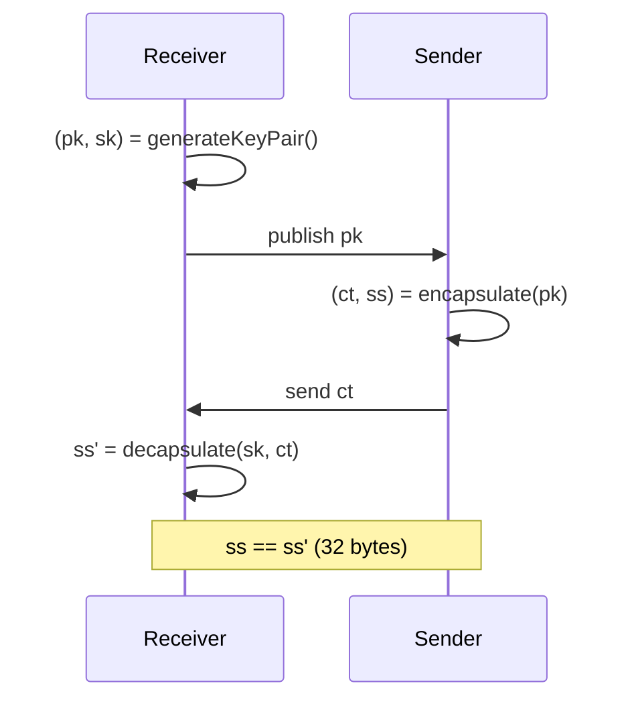

# ML-KEM (FIPS 203)

**Module-Lattice-Based Key-Encapsulation Mechanism** — formerly CRYSTALS-Kyber,
standardized by NIST as [FIPS 203](https://csrc.nist.gov/pubs/fips/203/final).
ML-KEM lets two parties establish a shared 32-byte secret over an insecure
channel. `pqcrypto` supports all three parameter sets and is byte-exact against
the NIST KAT corpus, with verified [OpenSSL interoperability](Validation-and-Interoperability).

## API

```dart
import 'package:pqcrypto/pqcrypto.dart';

final kem = PqcKem.kyber768; // or .kyber512 / .kyber1024

// Receiver: generate and publish the public key.
final (publicKey, secretKey) = kem.generateKeyPair();

// Sender: encapsulate to the public key.
final (ciphertext, sharedSecret) = kem.encapsulate(publicKey);

// Receiver: decapsulate to recover the same secret.
final recovered = kem.decapsulate(secretKey, ciphertext);
```

## How it works



ML-KEM operates over the polynomial ring `Z_q[X]/(X^256 + 1)` with `q = 3329`,
using the Number Theoretic Transform (NTT) for fast multiplication. Security
against chosen-ciphertext attacks (IND-CCA2) comes from the Fujisaki–Okamoto
transform: on decapsulation the implementation always computes both the
re-encryption secret and the implicit-rejection secret `J(z‖c)`, then selects
between them with a branchless constant-time mask, so a tampered ciphertext does
not leak through control flow. Sensitive intermediates are zeroized best-effort.

## Parameter sets

| Parameter set | NIST category | Public key | Secret key | Ciphertext | Shared secret |
| ------------- | ------------- | ---------- | ---------- | ---------- | ------------- |
| ML-KEM-512    | 1 (~AES-128)  | 800        | 1632       | 768        | 32            |
| ML-KEM-768    | 3 (~AES-192)  | 1184       | 2400       | 1088       | 32            |
| ML-KEM-1024   | 5 (~AES-256)  | 1568       | 3168       | 1568       | 32            |

Sizes are in bytes. The secret key is the expanded FIPS 203 form
`ByteEncode12(s) ‖ ek ‖ H(ek) ‖ z`. Default to **ML-KEM-768**; use **1024** for
long-lived confidentiality. **Validate exact lengths before any crypto.**

## Deterministic key generation (and interop)

`generateKeyPair` accepts an optional seed: 32 bytes (`d`) or 64 bytes
(`d‖z`). With the same 64-byte seed, OpenSSL derives the byte-identical public
key — the basis of the interop suite.

```dart
final seed64 = mySecureSeed(); // 64 bytes (d || z); protect like a secret key
final (pk, sk) = kem.generateKeyPair(seed64);
```

Use this for reproducible backup/restore and cross-implementation validation.
See [Validation & Interoperability](Validation-and-Interoperability).

## Important: a KEM is not encryption

`encapsulate` gives you a **32-byte shared secret**, not ciphertext for your
data. To encrypt application data you must:

1. derive a key from the shared secret with a KDF (HKDF), and
2. encrypt with an AEAD (AES-GCM / ChaCha20-Poly1305).

Neither HKDF nor AEAD is part of `pqcrypto`. The full, correct pattern is the
"Encrypt to a public key (KEM-DEM)" recipe in the [Cookbook](Cookbook).

## Caveats

- ML-KEM alone is **not authenticated transport**. It establishes a secret with
  whoever holds the public key — authenticate the public key (pinning,
  certificates, signed bundle) or you may be talking to an attacker.
- Pair with a classical exchange (X25519) via a KDF for a conservative hybrid —
  see [Serverpod & Flutter](Serverpod-Integration).
- This is KAT + interop evidence, not a CMVP/FIPS 140 validation; zeroization and
  side-channel resistance are best-effort in Dart. See
  [Security Posture](Security-Posture).

## See also

- [Cryptographic Algorithms](Cryptographic-Algorithms) · [ML-DSA](ML-DSA)
- [Validation & Interoperability](Validation-and-Interoperability)
- Canonical:
  [MLKEM_TESTING.md](https://github.com/turkananation/pqcrypto/blob/main/doc/MLKEM_TESTING.md)
  ·
  [OPENSSL_INTEROP.md](https://github.com/turkananation/pqcrypto/blob/main/doc/OPENSSL_INTEROP.md)
