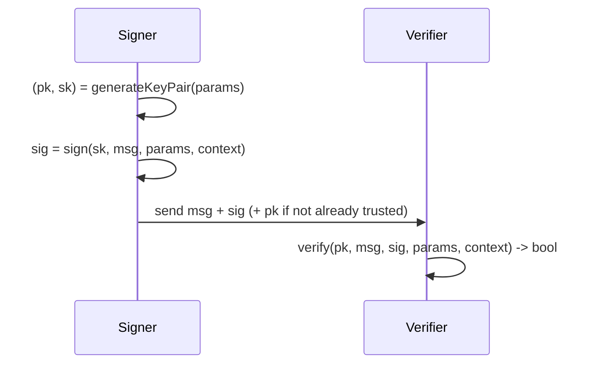

# SLH-DSA (FIPS 205)

**Stateless Hash-Based Digital Signature Algorithm** — formerly SPHINCS+,
standardized by NIST as
[FIPS 205](https://csrc.nist.gov/pubs/fips/205/final). SLH-DSA derives its
security *entirely* from hash-function assumptions — no lattices — which makes it
a conservative **diversifier** against any future lattice cryptanalysis.
`pqcrypto` supports all 12 parameter sets (both the SHAKE and SHA-2 hash
families) and is byte-exact on the 1,248-case official NIST ACVP sample corpus.

The trade-off is size and speed: tiny keys, but **large signatures** and **slow
signing** (especially the `s` sets). Verification stays reasonable. Favor SLH-DSA
for low-frequency, high-value, long-lived signatures — not per-request tokens.

## API

```dart
import 'dart:convert';
import 'dart:typed_data';
import 'package:pqcrypto/pqcrypto.dart';

final params = SlhDsaParams.shake128f; // default; or any of the 12 sets

final (publicKey, secretKey) = SlhDsa.generateKeyPair(params);

final message = Uint8List.fromList(utf8.encode('message bytes'));
final ctx = Uint8List.fromList(utf8.encode('myapp/purpose/v1')); // <= 255 bytes

final signature = SlhDsa.sign(secretKey, message, params, context: ctx);
final ok = SlhDsa.verify(publicKey, message, signature, params, context: ctx);
```

Signing is **hedged by default**. The `context` string (up to 255 bytes) gives
domain separation — use a distinct, versioned value per purpose, and pass the
same `context` to verify.

### Slow `s` sets require explicit opt-in

The small (`s`) sets sign in roughly tens of seconds in pure Dart, so they are
gated behind an explicit flag to prevent accidental use on a hot path:

```dart
final sig = SlhDsa.sign(
  secretKey,
  message,
  SlhDsaParams.shake256s,
  context: ctx,
  allowSlowSigning: true, // required for every `s` set
);
```

The fast (`f`) sets do not need this flag.

### Large messages (HashSLH-DSA)

```dart
final signature = SlhDsa.hashSign(
  secretKey,
  largePayload,
  SlhDsaPreHash.sha256,
  params,
  context: ctx,
);
final ok = SlhDsa.verify(publicKey, largePayload, signature, params, context: ctx);
```

`hashSign` pre-hashes the message with an approved function (FIPS 205 §10.2)
before signing; choose a `SlhDsaPreHash` whose strength matches the parameter
set's security category (e.g. `sha256`/`shake128` for category 1).

### Other entry points

- `SlhDsa.signDeterministic(sk, m, params, context: ...)` — deterministic
  (no fresh entropy). Explicit opt-in; the hedged default `sign` is preferred.
- `SlhDsa.hashSignDeterministic(...)` — deterministic HashSLH-DSA.
- Pass `verifyAfterSign: true` to any signing call to verify the freshly produced
  signature before returning it (adds the full verification cost; defends against
  generation faults).

## How it works



SLH-DSA composes a few-time FORS signature over the message with a hypertree of
WOTS+ one-time signatures and XMSS layers, all built from a single hash family.
There is no secret-key state to manage between signatures — it is **stateless**,
unlike LMS/XMSS.

## Parameter sets

Each row exists in **both** the SHAKE and SHA-2 hash families
(`SlhDsaParams.shake128s`, `SlhDsaParams.sha2128s`, and so on). Sizes are in
bytes.

| Parameter set | NIST category | Public key | Secret key | Signature |
| ------------- | ------------- | ---------- | ---------- | --------- |
| *-128s        | 1             | 32         | 64         | 7856      |
| *-128f        | 1             | 32         | 64         | 17088     |
| *-192s        | 3             | 48         | 96         | 16224     |
| *-192f        | 3             | 48         | 96         | 35664     |
| *-256s        | 5             | 64         | 128        | 29792     |
| *-256f        | 5             | 64         | 128        | 49856     |

`s` = small signature / slow signing; `f` = fast signing / larger signature. The
default is **SLH-DSA-SHAKE-128f**. **Validate exact lengths before verifying.**

## Message binding (BUFF)

SLH-DSA's message-bound (BUFF) property is **parameter-dependent**. Only the
`*-128f` sets reach the category-1 message-binding bound (FIPS 205 §11); for the
other sets a signature may be valid for more than one message in adversarial
signer scenarios. When a signature authorizes an action, transfer, or consent,
bind it to its purpose with a unique `context` **and** a nonce or unique message
identity inside the signed payload. The library cannot enforce protocol-level
message binding.

## Caveats

- `verify` returns **`false` (never throws)** on any malformed, wrong-length, or
  forged input — branch on the boolean.
- A public key is only an **identity** once you trust it (enrollment,
  attestation, certificate). A self-provided key proves nothing on its own.
- This is KAT/ACVP/regression evidence, not a CMVP/FIPS 140 validation;
  zeroization and constant-time behavior are best-effort in Dart. See
  [Security Posture](Security-Posture).

## See also

- [Cryptographic Algorithms](Cryptographic-Algorithms) · [ML-KEM](ML-KEM) ·
  [ML-DSA](ML-DSA)
- [Cookbook](Cookbook) — dual signatures, long-term/archival signing, firmware.
- [Validation & Interoperability](Validation-and-Interoperability) — ACVP and
  OpenSSL/liboqs interop evidence.
- Canonical:
  [SLHDSA_FIPS205_RELEASE_GUIDE.md](https://github.com/turkananation/pqcrypto/blob/main/doc/SLHDSA_FIPS205_RELEASE_GUIDE.md)
